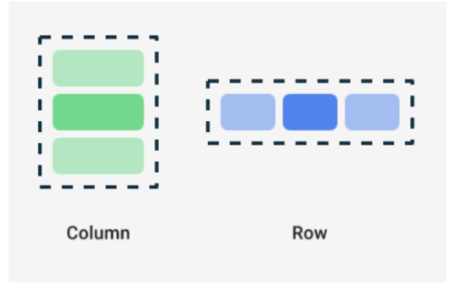
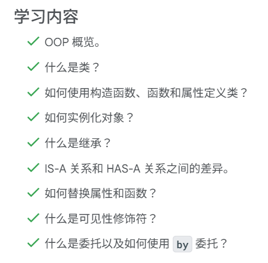

# Kotlin学习

## 二

将学习如何编写使用变量的代码，以便让程序的某些部分可以更改，而不必编写一套全新的指令


在变量名称后，需依次添加冒号、空格和变量的数据类型。如前所述，`String`、`Int`、`Double`、`Float,` 和 `Boolean` 是一些基本的 Kotlin 数据类型。本课程后面的内容会对这些数据类型进行详细介绍。请务必准确拼写数据类型，并以大写字母开头。

这些值称为“字面量”，因为它们是固定值或常量值（也就是保持不变的值）.

在 `count` 变量前面添加美元符号 `$`（即 `"You have $count unread messages."`）来修正您的程序。这是一个字符串模板，因为它包含模板表达式，在本例中为 `$count`。模板表达式是一种会将求得的值替换到字符串中的表达式。

如果您使用更复杂的表达式，就必须用大括号将该表达式括起来，并在大括号前添加 `$` 符号：`${unreadCount + readCount}`。用大括号括起来的表达式（即 `unreadCount + readCount`）的求值结果为 `105`。然后，`105` 这个值会替换到字符串字面量中。

利用类型推断，当 Kotlin 编译器可以推断（或确定）变量应属的数据类型时，您不必在代码中写入确切类型。这意味着，如果您为变量提供了初始值，就可以在变量声明中省略数据类型。Kotlin 编译器会查看初始值的数据类型，并假定变量会存储该类型的数据。

- `val` 关键字 - 预计变量值不会变化时使用。
- `var` 关键字 - 预计变量值会发生变化时使用。

在 Kotlin 中，建议尽量使用 `val` 关键字，而不是 `var` 关键字。

您可以使用 + 号将两个字符串加在一起（这种做法称为“串联”）。

```kotlin
fun main() {
    val nextMeeting = "Next meeting is:"
    val date = "January 1"
    val reminder = nextMeeting + date
    println(reminder)
}
```

本节编码规范：

- 量名称应采用驼峰式大小写形式，并以小写字母开头。
- 在变量声明中指定数据类型时，应在冒号后面添加一个空格。
- 赋值运算符 (`=`)、加号 (`+`)、减号 (`-`)、乘号 (`*`)、除号 (`/`) 等运算符的前后应有空格。
- 如果是编写更为复杂的程序，[建议每行不要超过 100 个字符](https://developer.android.com/kotlin/style-guide?hl=zh-cn#line_wrapping)。这样一来，您无需水平滚动计算机屏幕，便可轻松阅读程序中的所有代码。

如果您想用一行超过 100 个字符的长注释来详细说明代码，不妨使用多行注释。具体方法为：使用由正斜杠 (`/`) 和星号 (`*`) 组成的 `/*` 来作为多行注释的开头，在注释的每个新行开头添加一个星号，最后使用由星号和正斜杠符号组成的 `*/` 作为结尾。

```kotlin
/*
 * This is a very long comment that can
 * take up multiple lines.
 */
```

## 三、创建和使用函数


声明具有返回值类型的函数的语法


默认情况下，如果不指定返回值类型，默认返回值类型是Unit，相当于其他语言的woid类型。

对于不返回任何内容或返回Unit的函数，不需要使用return语句。


每个形参均由变量名称和数据类型组成，以冒号和空格分隔。多个形参以英文逗号分隔。

与某些语言（例如在 Java 中，函数可以更改传递到形参中的值）不同，Kotlin 中的形参是不可变的。您不能在函数主体中重新分配形参的值。

函数签名：函数名称及其输入（形参）统称为“函数签名”。函数签名包含返回值类型前面的所有内容，如以下代码段所示。

```kotlin
fun birthdayGreeting(name: String, age: Int)
```

具名实参：使您更改了实参的顺序，系统也会为相同的形参传入相同的值。


如需尝试 Kotlin 语言的更多练习，请查看 JetBrains Academy 的 [Kotlin 基础知识课程](https://hyperskill.org/tracks/18)。如需跳转到特定主题，请前往[知识图谱](https://hyperskill.org/knowledge-map)，查看上述课程涵盖的主题列表。


# 第一单元 您的首个Android应用

## 1.1 Kotlin简介

## 1.2 设置Studio

## 1.3 构建基本布局

可组合函数是界面的基本构建块，在compose中，可组合函数：描述界面中的某一部分；不会返回任何内容；接受一些输入并生成屏幕上显示的内容。

注解是用于在代码中附加额外信息的方式。此类信息可以帮助Jetpack Compose编译器等工具和其他开发者理解应用的代码。

可组合函数带有 [`@Composable`](https://developer.android.com/reference/kotlin/androidx/compose/runtime/Composable?hl=zh-cn) 注解，所有可组合函数都必须带有此注解，此注解可告知compose编译器：此函数用于将数据转换为界面。

Pascal命名法：复合词中的每个单词的首字母大写，与驼峰命名法之间的区别在于：在Pascal命名法中，所有单词的首字母都大写，但在驼峰命名法中，首字母可以是大写或小写。

尾随lambda语法

更改字体大小：可缩放像素sp是字体带下的度量单位，sp的大小会根据用户在手机设置下的首选文本大小进行调整，需要导入androidx.compose.ui.unit.sp，以使用.sp扩展属性

一个可组合函数里面可以有多个Text()函数：一个可组合函数可能会描述多个界面元素，不过，如果没有提供如何排列这些元素的指导，Compose可能会以不适合的方式排列它们

```kotlin
@Composable
fun GreetingText(message: String, from: String, modifier: Modifier = Modifier) {
    Text(
        // ...
    )
    Text(
        text = from
    )
}
```

Compose中的三个标准布局元素是Column、Row、Box可组合项：

Row函数通过导入androidx.compose.foundation.layout.Row来使用。Column函数通过导入androidx.compose.foundation.layout.Column来使用



举例：

```kotlin
// Don't copy.
Row {
    Text("First Column")
    Text("Second Column")
}
```

尾随lambda语法：在上述代码段中，Row可组合函数使用的是花括号而不是圆括号，这称为尾随lambda语法。当最后一个形参是函数时，kotlin提供了这种特殊语法来将函数作为形参传递给函数。

比较下面两个代码段可以更好地体会到这个语法：

1. 非尾随lambda语法：

   ```kotlin
   Row(
       content = {
           Text("Some text")
           Text("Some more text")
           Text("Last text")
       }
   )
   ```

2. 尾随lambda语法

   ```kotlin
   Row {
       Text("Some text")
       Text("Some more text")
       Text("Last text")
   }
   ```

对预览效果感到满意后，就可以在设备或模拟器上向应用添加你家可组合项：

1. 在 `MainActivity.kt` 文件中，滚动到 `onCreate()` 函数。
2. 从 `Surface` 代码块调用 `GreetingText()` 函数。
3. 传递 `GreetingText()` 函数、您的生日祝福和签名。

完成后的 `onCreate()` 函数应该会如同下面的代码段所示：

```kotlin
class MainActivity : ComponentActivity() {
    override fun onCreate(savedInstanceState: Bundle?) {
        super.onCreate(savedInstanceState)
        setContent {
            HappyBirthdayTheme {
                // A surface container using the 'background' color from the theme
                Surface(
                    modifier = Modifier.fillMaxSize(),
                    color = MaterialTheme.colorScheme.background
                ) {
                    GreetingText(message = "Happy Birthday Sam!", from = "From Emma")
                }
            }
        }
    }
}
```

将问候语居中：

1. 需在屏幕中心对齐问候语，请添加一个名为 `verticalArrangement` 的形参，添加到Colunm函数的参数里面，并将其设置为 `Arrangement.Center`

   ```
   @Composable
   fun GreetingText(message: String, from: String, modifier: Modifier = Modifier) {
       Column(
           verticalArrangement = Arrangement.Center,
           modifier = modifier
       ) {
           // ...
       }
   }
   ```

2. 围绕列添加 `8.dp` 内边距。最好以 `4.dp` 为增量使用内边距值

   ```kotlin
   @Composable
   fun GreetingText(message: String, from: String, modifier: Modifier = Modifier) {
       Column(
           verticalArrangement = Arrangement.Center,
           modifier = modifier.padding(8.dp)
       ) {
           // ...
       }
   }
   ```

3. 给Text函数添加参数textAlign将文本居中对齐

   ```kotlin
   Text(
       text = message,
       fontSize = 100.sp,
       lineHeight = 116.sp,
       textAlign = TextAlign.Center
   )
   ```

4.  给Text函数添加参数modifier使文本添加内边距并使其右对齐

   ```kotlin
   Text(
       text = from,
       fontSize = 36.sp,
       modifier = Modifier
           .padding(16.dp)
           .align(alignment = Alignment.End)
   )
   ```

# 第二单元 构建应用界面

## 2.1 Kotlin基础知识

——详细了解Kotlin、面向对象的编程和lambda的基础知识

### 2.1.2 在Kotlin中编写条件

1. if

   

   

2. when

   对分支数量更多的程序进行简化

   

   如果已经执行正文，程序会忽略后续的分支，并推出when语句

   ```kotlin
   fun main() {
       val trafficLightColor = "Black"
       
       when (trafficLightColor) {
           "Red" -> println("Stop")
           "Green" -> println("Go")
           "Yellow" -> println("Slow down")
           else -> println("Invalid traffic-light color")
       }
   }
   ```

   注意：when语句有一个变体，不接受任何形参，并且用于替换if/else链

   ```kotlin
   fun main() {
       val a = 5
       val b = 6
       
       when {
       	a > b -> println("a is greater than b")
       	a < b -> println("a is less than b")
       	else -> println("a is equal to b")
       }   
   }
   ```

3. 使用英文逗号处理多个条件

   

4. 使用in关键字处理一系列条件

   

   ```kotlin
   fun main() {
       val x = 3
   
       when (x) {
           2, 3, 5, 7 -> println("x is a prime number between 1 and 10.")
           in 1..10 -> println("x is a number between 1 and 10, but not a prime number.")
           else -> println("x isn't a prime number between 1 and 10.")
       }
   }
   ```

5. 使用is关键字作为条件，检查所评估值的数据类型

   

6. 使用if/else 和 when 作为表达式

   

   

   ```kotlin
   fun main() {
       val trafficLightColor = "Black"
   
       val message = 
         if (trafficLightColor == "Red") "Stop"
         else if (trafficLightColor == "Yellow") "Slow"
         else if (trafficLightColor == "Green") "Go"
         else "Invalid traffic-light color"
   }
   
   ```

   ```kotlin
   fun main() {
       val trafficLightColor = "Amber"
   
       val message = when(trafficLightColor) {
           "Red" -> "Stop"
           "Yellow", "Amber" -> "Slow"
           "Green" -> "Go"
           else -> "Invalid traffic-light color"
       }
       println(message)
   }
   ```

### 2.1.3 在Kotlin中使用可为null性

“可为null性”是许多编程语言中的常见概念，代表对变量不设置任何值，在kotlin中，系统会刻意处理可为null性，以实现null安全。


1. 可为null类型和不可为null类型

   `String`是不可为null类型，`String?`是可为null类型。

   Int..，Int?..。

   ......

2.  虽然简单地加个?就可以把一个类型转换为可使用null的类型，但是不要滥用可空类型，因为对于null类型会增加很多操作。

3. 处理可为null的变量

   - 使用`?.`（安全调用运算符

     `?.` 安全调用运算符可让您更安全地访问可为 null 的变量，因为 Kotlin 编译器会阻止变量成员为访问 `null` 引用而进行的任何尝试，并针对访问的成员返回 `null`。

   

   - 使用`!!` （非 null 断言运算符）来访问可为 null 的变量的方法或属性。除非确定变量不为 `null`，否则不建议使用 `!!` 非 null 断言运算符。一般不用非断言运算符

   - 使用`if/else`条件

     

     

   - 使用`?: Elvis`运算符

     

   

### 2.1.4 在kotlin中使用类和对象



面向对象的编程（OOP）涵盖四个基本概念：封装、抽象、继承、多态性。

#### 2.1.4.2 定义类

1. 类的定义语法：

   

2. 三大组成部分：

   属性：用于指定类对象属性的变量

   方法：包含类的行为和操作的函数

   构造函数：一种特殊的成员函数，用于在定义类的整个程序中创建类的实例

3. eg

   

#### 2.1.4.3 创建类的对象

#### 2.1.4.4 定义类方法

```kotlin
class SmartDevice {
    fun turnOn() {
        println("Smart device is turned on.")
    }
    
    fun turnOff() {
        println("Smart device is turned off.")
    }
    
}


fun main() {
    val smartTvDevice = SmartDevice()
    
    smartTvDevice.turnOn()
}
```

#### 2.1.4.5 定义类属性

方法用于定义类可以执行的操作，而属性用于定义类的特性或数据属性。

1. 举个栗子

   ```kotlin
   class SmartDevice {
       
       val name = "Android TV"
       val category = "Entertainment"
       val deviceStatus = "online"
       
        
       fun turnOn() {
           println("Smart device is turned on.")
       }
       
       fun turnOff() {
           println("Smart device is turned off.")
       }
       
   }
   
   
   fun main() {
       val smartTvDevice = SmartDevice()
       
       smartTvDevice.turnOn()
   }
   
   ```

2. 属性中的getter函数和setter函数

   - Kotlin 对属性、getter 和 setter 的处理非常优雅和简洁。
   - 当声明一个属性时，Kotlin 会自动（隐式地）为它提供默认的 getter 和 setter (对于 var 属性) 或只有 getter (对于 val 属性)。

   - Getter 和 Setter 是属性的组成部分，它们是控制属性如何被读取和修改的函数。Kotlin 通过简洁的语法使得使用它们（无论是默认的还是自定义的）都非常方便，同时保留了封装、数据验证和执行额外逻辑的能力。

   - > 当然也可以自定义，这可以增加一个验证过程，有利于提高代码的健壮性
     >
     > ```kotlin
     > var speakerVolume = 2
     > 	set(value) {
     > 		if (value in 0..100) {
     > 			field = value
     > 		}
     > 	}
     > ```

     

#### 2.1.4.6 定义构造函数

构造函数主要用途是指定类对象的创建方式，换言之，构造函数用于初始化对象，使其可供使用。

1. 定义方法1

   默认构造函数不含形参

   ```kotlin
   class SmartDevice constructor() {
       ...
   }
   ```

   如果构造函数中没有任何注解或可见性修饰符(后面将学习这个)，可以移除 `constructor` 关键字，如果构造函数中没有任何形参，还可以移除圆括号。

   ```kotlin
   class SmartDevice {
       ...
   }
   ```

2. 定义形参化构造函数

   ```kotlin
   class SmartDevice(val name: String, val category: String) {
   
       var deviceStatus = "online"
   
       fun turnOn() {
           println("Smart device is turned on.")
       }
   
       fun turnOff() {
           println("Smart device is turned off.")
       }
   }
   
   ```

3. kotlin中的构造函数主要有两类

   - 主要构造函数：个类只能有一个主要构造函数（在类标头中定义）。主要构造函数可以是默认构造函数，也可以是形参化构造函数。主要构造函数没有主体，表示其中不能包含任何代码。

   - 辅助构造函数：一个类可以有多个辅助构造函数。可以定义包含形参或不含形参的辅助构造函数。辅助构造函数可以初始化类，具有包含初始化逻辑的主体。如果类有主要构造函数，则每个辅助构造函数都需要初始化该主要构造函数。

     当使用辅助构造函数时，需要在辅助构造函数的签名后面使用this(...)来调用主构造函数

     不过这种方法用得很少。

     ```kotlin
     class SmartDevice(val name: String, val category: String) {
     
         var deviceStatus = "online"
         /*
         class SmartDevice constructor() {
             
         }
         */
         
     
         constructor(name: String, category: String, statusCode: Int) : this(name,category) {
             deviceStatus = when (statusCode) {
                 0 -> "offline"
                 1 -> "online"
                 else -> "unknown"
             }
         }
         
          
         fun turnOn() {
             println("Smart device is turned on.")
         }
         
         fun turnOff() {
             println("Smart device is turned off.")
         }
         
     }
     
     
     fun main() {
         val smartTvDevice = SmartDevice("aaa","hhh")
         
         smartTvDevice.turnOn()
         println(smartTvDevice.name)
         println(smartTvDevice.deviceStatus)
     }
     ```

     

#### 2.1.4.7 实现类之间的关系

1. 在 Kotlin 中，所有类默认都是最终类，也就是说您无法扩展这些类，因此必须定义类之间的关系：

   ```kotlin
   class MyClass // 这个类是 final 的，不能被继承
   
   // 如果你想让一个类可以被继承，你需要显式使用 `open` 关键字
   open class MyOpenClass // 这个类可以被继承
   ```

   这个限制促使开发者更多地依赖组合、接口实现和委托等方式来构建类与类之间的关系和实现代码复用，而不是轻易地使用继承。这被认为是现代面向对象设计的一种更优实践。

2. 类之间的关系

   - IS-A关系

   - HAS-A关系

     通过**在一个类中将另一个类的实例作为其成员属性（或字段）来实现的**。

     > ```kotlin
     > // “被拥有者”类
     > class Engine(val type: String) {
     >     private var isRunning: Boolean = false
     > 
     >     fun start() {
     >         if (!isRunning) {
     >             println("$type engine started.")
     >             isRunning = true
     >         } else {
     >             println("$type engine is already running.")
     >         }
     >     }
     > 
     >     fun stop() {
     >         if (isRunning) {
     >             println("$type engine stopped.")
     >             isRunning = false
     >         } else {
     >             println("$type engine is already off.")
     >         }
     >     }
     > 
     >     fun getStatus(): String {
     >         return if (isRunning) "$type engine is running" else "$type engine is off"
     >     }
     > }
     > 
     > // “拥有者”类
     > class Car(val brand: String, val model: String, engineType: String) {
     >     // 1. 声明成员变量，类型是 Engine
     >     // 2. 在构造函数中初始化 Engine 实例（这里是直接创建）
     >     private val carEngine: Engine = Engine(engineType) // Car HAS-AN Engine
     > 
     >     fun startCar() {
     >         println("Trying to start $brand $model...")
     >         // 3. 使用 carEngine 实例的方法
     >         carEngine.start()
     >     }
     > 
     >     fun stopCar() {
     >         println("Trying to stop $brand $model...")
     >         carEngine.stop()
     >     }
     > 
     >     fun checkEngineStatus() {
     >         println(carEngine.getStatus())
     >     }
     > }
     > 
     > fun main() {
     >     // 创建 Car 对象时，它内部会创建一个 Engine 对象
     >     val myCar = Car("Toyota", "Camry", "V6")
     >     myCar.startCar()          // Toyota Camry... V6 engine started.
     >     myCar.checkEngineStatus() // V6 engine is running
     >     myCar.stopCar()           // Toyota Camry... V6 engine stopped.
     > 
     >     println("---")
     > 
     >     val electricCar = Car("Tesla", "Model S", "Electric Motor")
     >     electricCar.startCar()      // Tesla Model S... Electric Motor engine started.
     > }
     > ```

   - 替换子类中的父类方法

     简单来说，open 就像给子类一个“许可”，允许它们对某个功能进行“个性化定制”。override 则是子类声明：“我正在使用这个许可，对这个功能进行我自己的定制！” 而多态则是系统能够智能地识别出应该执行哪个“定制版本”的能力。

     > 详细说明见文件：
     >
     > [替换子类中的父类方法](./学习过程中的小知识点/kotlin学习之替换子类中的父类方法.md)

   - 替换子类中的父类属性

     与替换方法类似

   - **使用多态：**

     - 创建一个父类类型的变量。
     - 让这个变量引用不同子类的对象。
     - 当你通过这个父类类型的变量调用被重写的方法时，会自动执行对应子类中的版本。

   

   

#### 2.1.4.8 可见性修饰符modifier


#### 2.1.4.9 定义属性委托

想象一下，你在写代码，发现好几个地方都在做同样的事情。比如，在 SmartTvDevice 类里，你要确保 speakerVolume（音量）和 channelNumber（频道号）的值不能超出某个范围。在 SmartLightDevice 类里，你要确保 brightnessLevel（亮度）的值也不能超出某个范围。

每次都写一遍检查范围的 if 语句在 set 方法里，是不是很重复，也很麻烦？如果以后要改检查逻辑，每个地方都要改。

**属性委托就是一种把这种重复的“管理属性值的逻辑”抽出来，变成一个可复用的“小帮手”的方法。**

1. 创建属性委托

   

   **创建属性委托的语法是以变量声明开头，后面依次跟** **by** **关键字以及用于为属性处理 getter 和 setter 函数的委托对象**

   其中delegate object是一个实现了ReadWriteProperty接口的类。

   **ReadWriteProperty** **是接口，不是类**

   所谓接口在后面会学习。

   [点击跳转关于属性委托的更详细信息。](./学习过程中的小知识点/属性委托.md)

   eg:

   >```kotlin
   >fun main() {
   >    var myProperty: Int by MyDelegateObject()
   >//  ↑          ↑    ↑   ↑
   >// 属性声明     类型  by  负责管理这个属性的“小帮手”对象
   >// (var 或 val)       关键字
   >
   >}
   >```

2. **若要实现您可以委托实现的目标类，您必须熟悉接口。接口是实现它的类必须遵循的协议**

   

   > ```kotlin
   > import kotlin.properties.ReadWriteProperty
   > import kotlin.reflect.KProperty
   > 
   > class RangeRegulator() : ReadWriteProperty<Any?, Int> {
   >     initialValue: Int,
   >     private val minValue: Int,
   >     private val maxValue: Int,
   > } : ReadWriteProperty<Any?, Int> {
   >     
   >     var fieldData = initialValue
   >     
   >     override fun getValue(thisRef: Any?, property: KProperty<*>): Int {
   >         return fieldData
   >     }
   > 
   >     override fun setValue(thisRef: Any?, property: KProperty<*>, value: Int) {
   >         if (value in minValue..maxValue) {
   >             fieldData = value
   >         }
   >     }
   > }
   > 
   > 
   > ```

   > ```kotlin
   > // 在 SmartTvDevice 中
   > private var speakerVolume by RangeRegulator(initialValue = 2, minValue = 0, maxValue = 100)
   > private var channelNumber by RangeRegulator(initialValue = 1, minValue = 0, maxValue = 200)
   > 
   > // 在 SmartLightDevice 中
   > private var brightnessLevel by RangeRegulator(initialValue = 0, minValue = 0, maxValue = 100)
   > ```


### 2.1.5 在Kotlin中使用函数类型和lambda表达式


#### 2.1.5.3 将函数存储在变量中

1. 函数引用运算符`::`

2. 使用lambda表达式重新定义函数

   lambda 表达式提供了简洁的语法来定义函数，无需使用 `fun` 关键字。可以直接将 lambda 表达式存储在变量中，无需对其他函数进行函数引用。

   

   在赋值运算符的前面需要加上关键字var或val，后接变量名；

   赋值运算符后面是lambda表达式，由一对大括号组成，而大括号中的内容则构成函数正文

3. 例子

   > ```kotlin
   > fun main() {
   >     val trickFunction = trick    
   >     
   >     trick()
   >     trickFunction()
   > }
   > 
   > val trick = {
   >     println("No treats!")
   > }
   > ```

#### 2.1.5.4 将函数作为数据类型

1. 将函数作为返回值类型

   函数是一种数据类型，可以像使用任何其他数据类型一样使用函数，也可以从其他函数中返回函数。语法如下：

   

   在下面这个例子中，`: () -> unit`说明trickOrTreat函数返回的函数是一个没有输入参数、没有显式的返回值的函数

   > ```kotlin
   > fun main() {
   >     
   >     val treatFunction = trickOrTreat(false)
   >     val trickFunction = trickOrTreat(true)
   >     
   >     treatFunction()
   >     trickFunction()
   >     
   > }
   > 
   > 
   > fun trickOrTreat(isTrick: Boolean): () -> Unit {
   >     if (isTrick) {
   >         return ::trick
   >     } else {
   >         return treat
   >     }
   > 
   > }
   > 
   > 
   > 
   > 
   > fun trick(): Unit  {
   >     println("No treats!")
   > }
   > 
   > val treat = {
   >     println("Have a treat!")
   > }
   > 
   > 
   > ```

2. 将一个函数作为参数传递到另一个函数

   

​	


## 2.2 创建交互式Dice Roller应用

### 2.2.3调试

这里没学，后面用到再补

## 2.3 与界面和状态交互

### 2.3.3 Compose中的状态

#### 2.3.3.1  

从本质上讲，应用中的状态是指可以随时间变化的任何值，包含应用中从数据库到变量等的所有元素。

在2.3.3中，我们将探索在使用Compose是如何使用和看待状态，我们将使用以下内置Compose界面元素：

- TextField：可组合项，用于输入和修改文本
- Text：可组合项，用于显示文本
- Spacer：可组合项，用于显示界面元素之间的空白空间


样式和主题是一个属性集合，用于指定单个界面元素的外观，样式可以指定某些属性，例如字体颜色、字号、背景颜色等可以应用到整个应用的属性。

#### 2.3.3.5 组合

应用中的可组合项描述的界面将显示一个列或行，Compose是一个声明性界面框架，这意味着可以在代码中声明界面的外观，但如果想让界面在运行时或客户与应用互动时发生变化该怎么办？

此时需要依赖名为“重组”的进程来更新应用的组合。

“组合”是对Compose在执行可组合项时所构建界面的描述，Compose应用调用可组合函数，以将数据转换为界面，如果发生状态更改，Compose会使用新状态重新执行受影响的可组合函数，从而创建更新后的界面。这一过程称为“重组”。

当Compose首次运行可组合函数时，在初始组合期间，它会跟踪我们为了描述组合中的界面而调用的可组合函数。重组是指Compose重新执行可能因数据更改而更改的可组合项，然后更新组合以反映所有更改。

在Compose中可以使用State和MutableState类型让应用中的状态可被Compose观察或跟踪。

`State` 类型不可变，因此您只能读取其中的值，而 `MutableState`类型是可变的。可以使用 `mutableStateOf()` 函数来创建可观察的 `MutableState`。它接受初始值作为封装在 `State` 对象中的形参，这样便可使其 `value` 变为可观察。

mutableStateOf()函数返回的值：

- 会保持状态，即账单金额
- 可变，因此该值可以改变
- 可观察，因此Compose会观察值的所有更改并触发重组以更新界面

#### 2.3.3.6 使用remember函数保存状态

通过添加委托的getter和setter导入内容，可以读取和设置amountInput，而无需引用MutableState的value属性。

# 3.

## 3.1

### 3.1.1 泛型、对象和扩展


#### 3.1.1.4


# 埋坑

## 1. `Modifier` 和子元素

1.3中留下的坑

## 2. 字体大小

1.3.6 可缩放像素和密度无关像素

## 3. text函数的参数

text、fontSize、lineHeight

## 4. 居中对齐

了解Column的参数

## 5. 了解MainActivity的格式和组合

## 6. 如果构造函数中没有任何注解或可见性修饰符(后面将学习这个)

2.1.4.6 定义构造函数中埋下的坑


