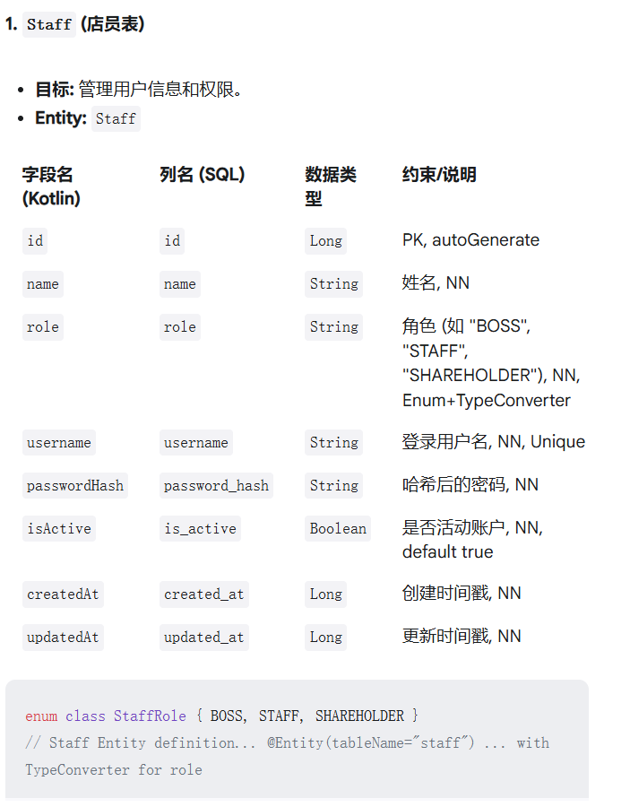
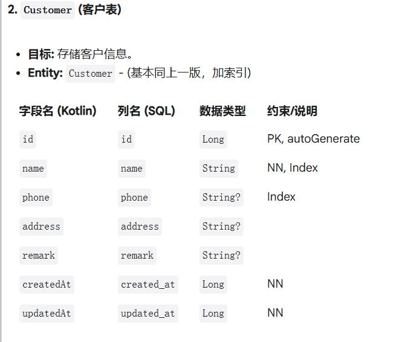
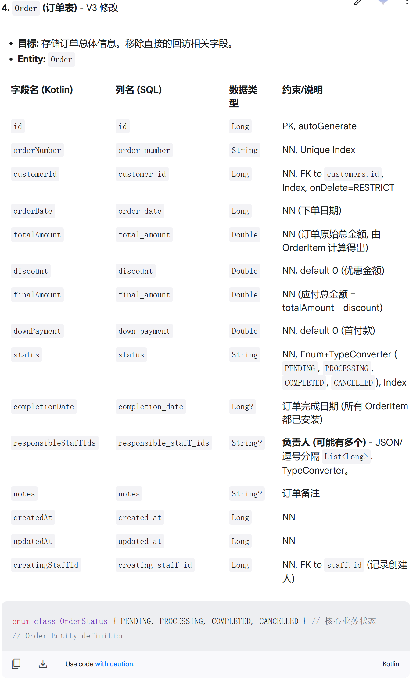
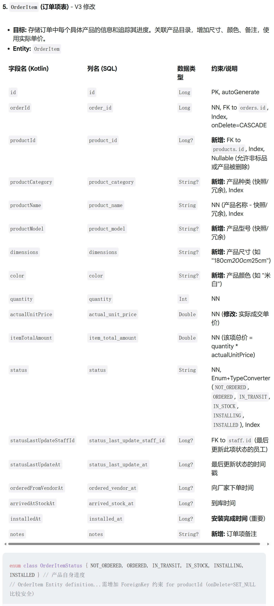
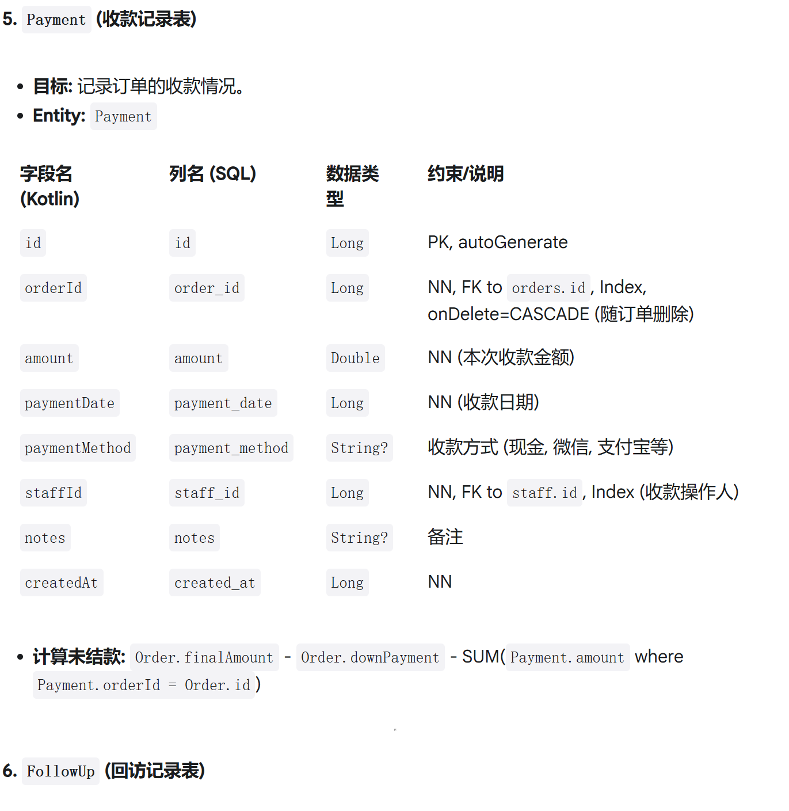
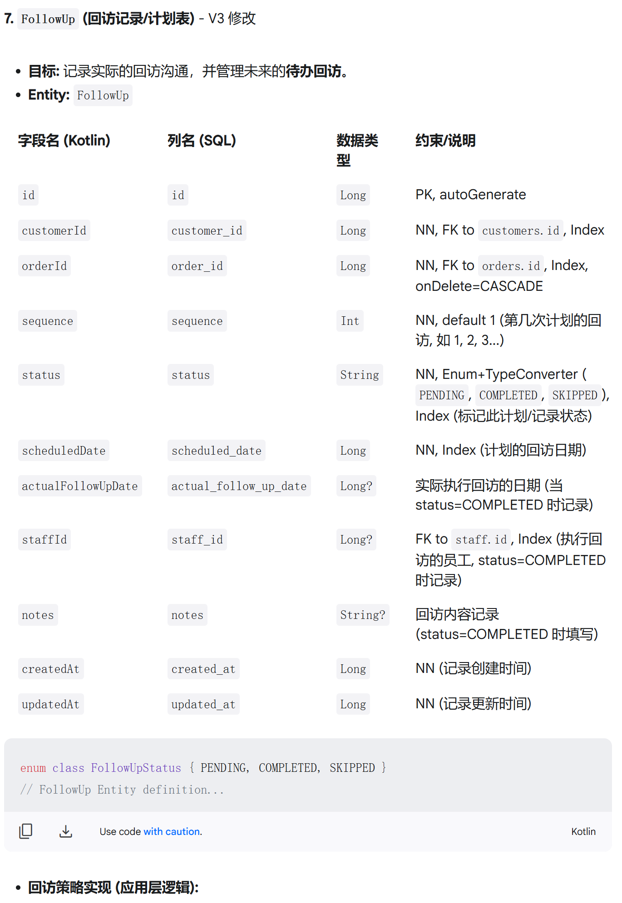
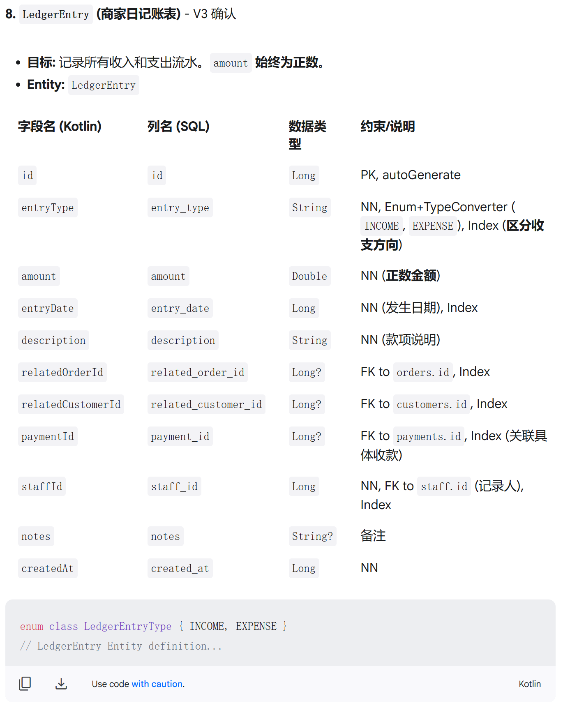
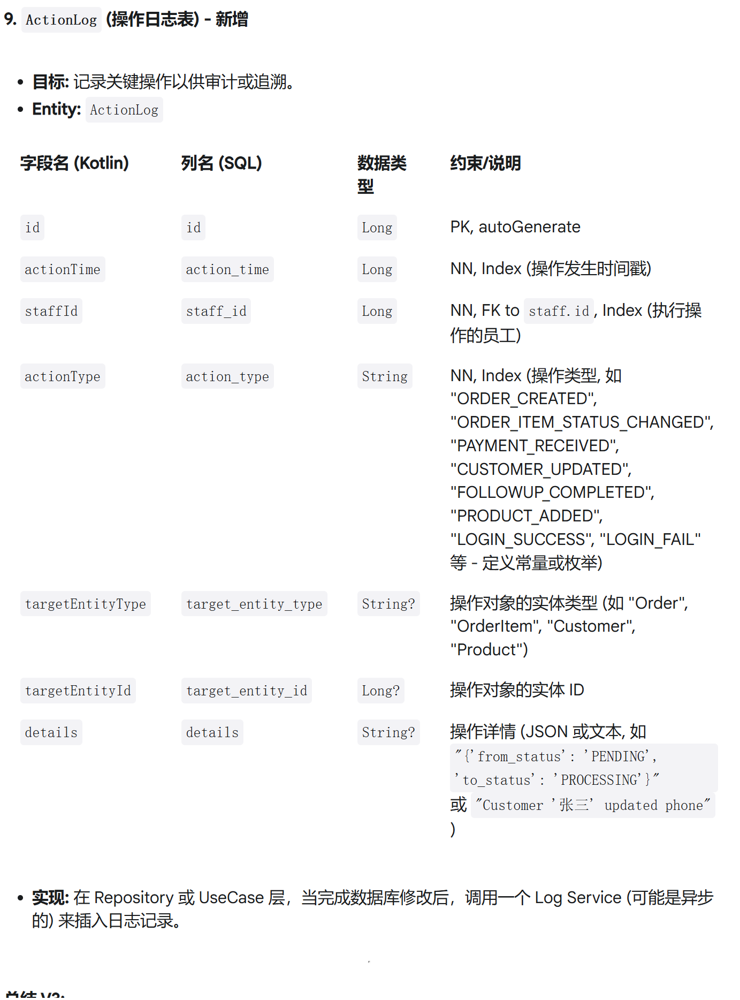

就让我来基于你的建议梳理一下客户管理和增强订单所需要的核心字段和它们之间的关系，非常期待你提出改进建议，因为我是个新手，没有这方面的经验。

我先说明以下对于一个商家来说，他们的想要的功能：

1. 客户添加————————

2. 订单添加

   在添加订单前必须先添加客户，一个客户可以同时有多个订单，订单里的信息主要有：下单客户、下单日期、客户电话、客户住址、下单产品、下单产品个数、每种产品的金额、下单总金额、优惠（折扣）、订单跟进人（跟进人可能有多个）、首付款、未结款

3. 产品进度跟进

   订单一旦创建好，产品进度跟进就开始起作用了。

   首先说明，产品将经历以下几个阶段：未下单、已下单、物流中、已到库（待安装）、已安装、待回访（这个时候就体现出了记录安装时间的重要性，回访时间可由商家自己设定，每个一段这样的时间，产品将再一次出现在待回访列表中）、已回访。产品不可以跨越阶段。

   接下来我将说明流程，订单中的产品将出现在未下单列表中，提示商家需要向上级厂家提交订单，下单完成的产品需要由商家手动设置为已下单，接下来产品将出现在已下单列表中，已下单列表中的产品再出现在物流中列表，产品到达并且清点后，商家将其划分为已到库，到客户家里安装后商家将产品设置为已安装，并且同时出现在已回访列表，自安装之日起开始计时，商家可自己设置回访时间，每隔一段这样的时间，产品将再一次出现在待回访列表中。

   还要说明，这整个流程中，每一个流程的进行都需要留下对应执行人的签名，因为商店里可能有多名店员，这又涉及到店员管理。

4. 查看订单

   订单可以随时查看，并且订单中的产品可以链接到产品进度跟进。意思就是说在界面里点击订单里的产品，商家可以看到产品的进度。

   实际上订单也分为多个阶段：订单生成、订单进行中、订单完成、订单待回访、订单已回访。

   生成订单后，订单自动进入进行中阶段，只有当订单里所有产品安装完成后订单才算完成，以完成订单时间为准，按照商家设定的回访时间，按时提醒商家对客户进行回访。

5. 客户回访

   这部分从前面的描述可知，客户回访是一个自动触发的选项，我这里列出来是因为对于客户回访也需要做一些设置，比如回访时间、回访提醒、查看回访、回访记录。

6. 收款管理

   在这里面可以查看客户的未结款，并且对客户款项进行管理，如后续收款，当然，每一个收款都需要有收款人、收款方式、收款时间

7. 商家账目

   其中有商家所有的进出款

8. 店员管理

   不同的店员使用权限也不一样，有老板、普通店员、股东之分

我担心一个比较大的问题，就是我的想法里面外键关联太多、也太杂乱了，不过我听说，一般我上面说的其实是界面视图，对于真正的数据表可能并不会这么设计

你的核心实体梳理不错，你说得产品目录我认为是需要的，这对于管理标准化的产品很重要，产品目录下，我想要有产品种类、产品名称、产品型号、产品默认价钱（不过在订单页中，这个单价不一定就是默认价钱，因为这有时取决于商家与客户的谈判）；

还有就是在创建订单，加入产品时，我的设想是，界面里出现一个下拉选择框，依次选择产品类型、名字、型号。并且我要补充说明一点，部分产品在建立订单时是要说明尺寸的；大部分商品还需要有颜色；并且，我现在觉得在订单建立时，还可能需要有备注信息；

关于回访日期，我目前是认为想统一设置，放在客户回访管理页中；

并且回访我想应该是循环的，不过回访间隔时间慢慢加长，我举个例子，用户订单完成后，第一次商家间隔一个月对客户进行回访，第二次间隔三个月对客户进行回访，第三次是半年，第四次是一年……，我想，从完成订单到最后一次回访，期间间隔总时间可能会达到20年。

产品进度跟踪、收款、回访等功能我是这样想的：所有被下单的产品连带着它的关联订单在下单后自动出现在“工单”界面，也就是说，工单中的条目是一个个的已经被客户选定的产品，工单进行统一管理。点击工单中的产品可以设置它们的状态 （ "未向厂家下单" "已下单给厂家" "厂家已发货 (物流中)""已到库 (待安装)" "安装中""已安装"），在顶部可以对工单进行筛选（按状态筛选、按订单筛选、按客户筛选）。至于订单以及订单里面产品的状态，我认为应该要做到能够自动实现从工单中获取与同步。

还应该注意，当工单状态达到 "已下单给厂家"时，产品还应该能够自动出现在库存里并发出提醒告知用户（在这里我认为首页还应该有一个消息提醒，这个消息提醒应该是所有店员都能收到（当然如果有些消息是有权限的话还需要一个筛选）），当工单状态达到"已安装"时，产品应该能够从库存中移除并按照上述方式提醒用户。

在工单列表里显示的产品，应该展示最醒目的信息（产品名字、所属订单、所属客户、产品状态），我还希望不同的产品状态有不同的字体颜色。

在点击工单中的产品，我们还应该跳转产品详情页面（实际上，如果点击订单中的产品条目也应该跳转到这个界面），这里应该有产品的详细信息以及工单状态情况以及每个状态的操作者（操作者不应该是可编辑的，而应该是由应用自行识别用户账号并写入的）（关于工单状态，我倾向于用一条节点线来表示，这样既直观有清晰，节点可以点击来设置工单状态），如果说产品已经到库，我认为还需要加一个备注（我的设想是这个备注可以为空也可以为文字可以文字和图片都有）

你应该还记得，在我们的首页客户管理栏里面有一个工单的导航。

操作日志我认为也是很有必要的；

你的商家日记账表做得我觉得很不错，不过，考虑到日记账既有出账也有入账，总金额不一定是正数，并且也许还需要设置每一笔记录是出账还是进账

库存表还需要完善，除了一些基本信息外，还需要一个标识是否已经被预定的变量；你说的“一个店铺中的同一种产品，只应该有一条库存记录”，这句话我觉得是不完善的，对于不需要定制的产品来说，确实只应该有一条库存记录，但是如果是定制的商品，尽管它们是同一种产品也是同一种型号，定制的内容确实不尽相同的，这里应该有所区分。我主张，在创建库存时还需要一个是否定制的标识，这样在查看库存时也相应地可以根据这个标识分别查看。也就是说在订单创建的产品添加时就应该再添加一个是否定制的标识。

另外，关于用户体验，在添加产品到订单时，我认为不仅应该可以从下拉列表里面选，也应该具有输入功能，可以在用户输入产品的同时不断缩小下拉列表的范围，最终找到用户想要的产品。

还有一点，我认为在添加订单时，我们需要在一个搜索框里搜索客户，但是有事客户并没有被添加，如果这时再返回去添加客户，未免有些麻烦，我认为可以在没有匹配到客户时，搜索栏的下拉列表不在显示客户，而是出现一个可以添加客户的选项，点击这里也应该可以添加客户

我认为我们这一段对话实在是太长了，有点太卡顿了，我还是需要请你帮我生成一段完善的引导词，让我可以新开一段对话，然后由你继续带我完成我们的Android应用开发，一定要完善啊！

数据库结构

1. 核心实体
   1. **Customer (客户)**
   2. **Order (订单)**
   3. **OrderItem (订单项/订单中的具体产品实例)** - *这是关键的新增实体，用来跟踪每个产品的进度*
   4. **Staff (店员/用户)** - *用于权限、操作记录*
   5. **Payment (收款记录)**
   6. **FollowUp (回访记录)**
   7. **LedgerEntry (日记账条目)**
   8. ******Product (产品目录)** - 如果需要管理标准化的产品信息（品名、型号、默认价格等），可以添加此表。
   9. **ActionLog (操作日志)** - 用于记录关键操作（如状态变更）和执行人，比在每个表里加 staffId 更灵活，但更复杂。

​			

- **逻辑:**

  - 
  - 创建 OrderItem 时，如果选择了标准产品 (productId 非空)，则从 Product 表带出 category, name, model 填入本表的快照字段。允许手输覆盖或录入非标品。
  - Order.totalAmount = SUM(OrderItem.itemTotalAmount) for the order.
  - 当一个 Order 下所有 OrderItem 的 status 都为 INSTALLED 时:
    - 
    - 更新 Order.status 为 COMPLETED.
    - 记录 Order.completionDate (通常取所有 installedAt 中的最大值).
    - **触发**创建第一条**回访计划** (插入到 FollowUp 表).

  

- **回访策略实现 (应用层逻辑):**
  1. 定义回访间隔序列 intervals = [1 month, 3 months, 6 months, 1 year, 1 year, ...] 直到满足总年限（如20年）。
  2. **首次触发:** 当 Order 完成时，计算 firstScheduledDate = Order.completionDate + intervals[0]，创建 FollowUp(orderId=..., sequence=1, status=PENDING, scheduledDate=firstScheduledDate)。
  3. **待回访列表:** 查询 FollowUp WHERE status = PENDING AND scheduledDate <= today().
  4. **完成回访:**
     - 找到对应的 PENDING 记录 (currentFollowUp)。
     - 更新 currentFollowUp.status = COMPLETED, actualFollowUpDate = now(), staffId, notes。
     - 获取 currentSequence = currentFollowUp.sequence。
     - 如果 currentSequence 对应的回访策略未结束 (比如还没到20年):
       - 计算 nextInterval = intervals[currentSequence] (注意数组越界)。
       - 计算 nextScheduledDate = currentFollowUp.actualFollowUpDate + nextInterval (基于实际完成时间算下一次)。
       - 创建 **新的** FollowUp(orderId=..., sequence=currentSequence + 1, status=PENDING, scheduledDate=nextScheduledDate)。
  5. **跳过回访:** 更新 status = SKIPPED，可以选择是否基于 scheduledDate 计算并创建下一条 PENDING 记录。

- **理解:** 记录一笔 500 元支出，是 entryType = EXPENSE, amount = 500.0。记录一笔 1000 元收入，是 entryType = INCOME, amount = 1000.0。查询总余额或收支汇总时再根据 entryType 进行加减计算。

- **实现:** 在 Repository 或 UseCase 层，当完成数据库修改后，调用一个 Log Service (可能是异步的) 来插入日志记录。

- **业务逻辑:** 应用层的逻辑会更复杂，例如：
  - 
  - 订单总金额、最终金额、未结款的计算。
  - Order 状态与 OrderItem 状态的联动。
  - 回访计划的生成和更新逻辑。
  - ActionLog 的记录逻辑。
  - 权限控制 (基于 Staff.role)。