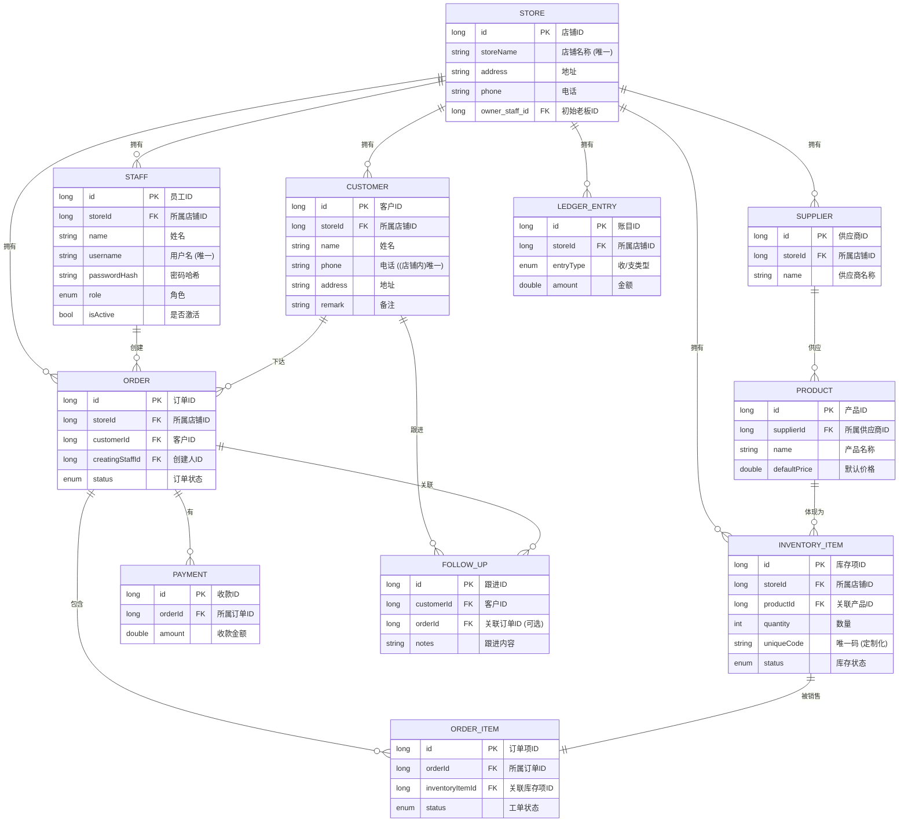

**项目进展报告 (阶段性总结): OrderManager Android 应用**

**报告日期:** 2024年6月17日 (请修改为实际日期)

**致:** 甲方

**发件人:** [你的名字或团队名称]

**主题:** OrderManager 应用核心架构与多模块功能开发阶段性总结报告

**1. 项目概述与成就回顾**

我们非常高兴地向您报告，OrderManager Android 应用的核心开发阶段已取得重大进展。我们不仅完成了最初设想的基础功能，更构建了一个健壮、高度可扩展的平台，为未来的发展奠定了坚实的基础。目前的应用已经超越了一个简单的记录工具，初步具备了成为一个强大的多用户、多店铺协同作业系统的能力。

**2. 核心架构亮点**

我们采用了一套现代化的、业界领先的 Android 技术架构，以确保应用的稳定性、性能和未来的可维护性：

- **店铺数据隔离模型:** 我们成功引入了**“店铺 (Store)”**的核心概念，并重构了数据模型。现在，应用支持**多店铺、多老板、多员工**的组织结构，所有核心数据（如员工、客户、产品、供应商、订单、财务）都实现了严格的**店铺专属隔离**，确保了数据的安全性和独立性。
- **响应式数据流:** 通过全面采用 Kotlin Flow 和响应式编程范式，应用的大部分界面都能在数据发生变化时**自动、实时地更新**，无需用户手动刷新，提供了流畅、现代的用户体验。
- **分层架构 (MVVM):** 清晰地划分了 UI 层、业务逻辑层 (ViewModel) 和数据层 (Repository, DAO)，使得代码逻辑清晰、易于测试和扩展。
- **依赖注入 (Hilt):** 通过集成 Google 官方推荐的 Hilt 框架，我们实现了对所有组件的自动化管理，极大地降低了代码的耦合度，提高了应用的健壮性。
- **本地持久化 (Room):** 使用 Room 数据库，并设计了包含 11 个核心表的复杂数据库结构 (版本 10+)，支持了所有已规划的业务功能，并为未来的数据迁移和版本管理做好了准备 (exportSchema)。

**3. 已完成的核心功能模块**

目前，应用已经具备了以下功能齐全、可供内部测试的核心模块：

- **用户认证与多角色系统:**
  - **注册流程:** 支持新用户创建自己的**店铺**和关联的**老板 (BOSS)** 账户。
  - **登录/登出:** 支持不同角色的员工（老板、普通员工、股东）登录和安全登出。
  - **会话管理:** 能在应用重启后保持用户的登录状态。
- **主应用框架:**
  - **底部导航:** 实现了包含“工作”和“我的”两个主要标签页的现代化主界面，导航逻辑清晰。
  - **工作台仪表盘 (WorkScreen):** 作为功能入口的集合，提供了到各个核心模块的快速导航。
- **供应商与产品管理 (SupplierProductScreen):**
  - 实现了直观的**左右双栏联动**界面，可以清晰地查看供应商及其提供的产品。
  - 支持**添加、编辑、删除**供应商和产品，产品与供应商严格关联。
- **库存管理 (InventoryScreen):**
  - **实现了对“标准化库存”和“定制化单件”的区分管理**，这是一个非常贴近真实业务的复杂功能。
  - 支持按供应商筛选查看库存。
  - (后台逻辑) 为后续的**库存自动增减**打下了基础。
- **客户管理 (CRM):**
  - 实现了基于店铺的客户列表、搜索、添加、编辑、删除。
  - **实现了客户详情页 (CustomerDetailScreen)**，为未来展示客户相关订单和跟进记录提供了空间。
  - 实现了在创建订单时“即时添加新客户”的流畅体验（通过导航结果传递）。
- **订单/工单管理 (部分核心实现):**
  - **订单创建 (AddEditOrderScreen):**
    - 实现了**响应式的客户搜索选择器**和**产品搜索选择器**，极大提升了开单效率。
    - 支持动态添加、修改、移除多个订单项。
    - 支持记录订单金额、折扣、首付、备注等。
    - 订单的创建与当前店铺和操作员自动关联。
  - **工单列表与详情 (WorkOrderListScreen, WorkOrderDetailScreen):**
    - 所有订单项会自动作为“工单”在专门的界面进行跟踪。
    - 实现了直观的**状态时间线** UI，可展示每个状态的操作人和时间。
    - 实现了**状态更新**的完整逻辑，包括与**库存的自动联动**（产品到库时自动增库存，安装后自动减库存）和**订单主状态的自动完成**。
- **“我的”页面 (MeScreen):**
  - 实现了根据**老板/员工角色显示不同操作菜单**的功能。
  - 为老板提供了“员工管理”的入口。
- **员工管理 (StaffManagementScreen):**
  - 实现了老板对自己店铺下**员工的列表查看、状态激活/禁用**。
  - 实现了**添加新员工**（可指定角色）和**编辑/重置密码**的核心功能。

**4. 下一步工作规划**

基于当前坚实的基础，我们将按计划推进以下工作，逐步完善应用的业务闭环：

1. **完善订单与财务流程:**
   - **回款管理 (PaymentScreen):** 实现记录订单回款的功能。
   - **店铺日记账 (LedgerScreen):** 完善收支流水的记录和按日期范围的筛选查看。
2. **完善客户跟进与回访:**
   - **手动跟进 (FollowUpScreen):** 实现通用的客户跟进记录功能。
   - **自动回访:** 实现基于订单完成日期的自动回访计划生成和提醒。
3. **用户体验与细节优化:**
   - 在各个界面添加更丰富的筛选和排序功能。
   - 完善图片上传功能（如产品、库存凭证、日记账凭证）。
   - 在客户详情页中展示其关联的订单列表。
   - 将 WorkScreen 升级为包含关键业务指标的“数据看板”。

**5. 总结**

OrderManager 应用已成功度过最关键的基础架构设计和核心模块开发阶段。目前的应用不仅功能强大，而且拥有一个高度可扩展和可维护的现代化架构。我们对项目的未来充满信心，并将继续高效地推进后续功能的开发，力求打造一款真正能为商家赋能的优秀产品。

------

这份总结旨在全面而清晰地展示我们的工作成果。你可以根据需要调整其中的措辞和细节，以便更好地向甲方沟通。我们确实取得了非常大的进展！

thumb_upthumb_down

